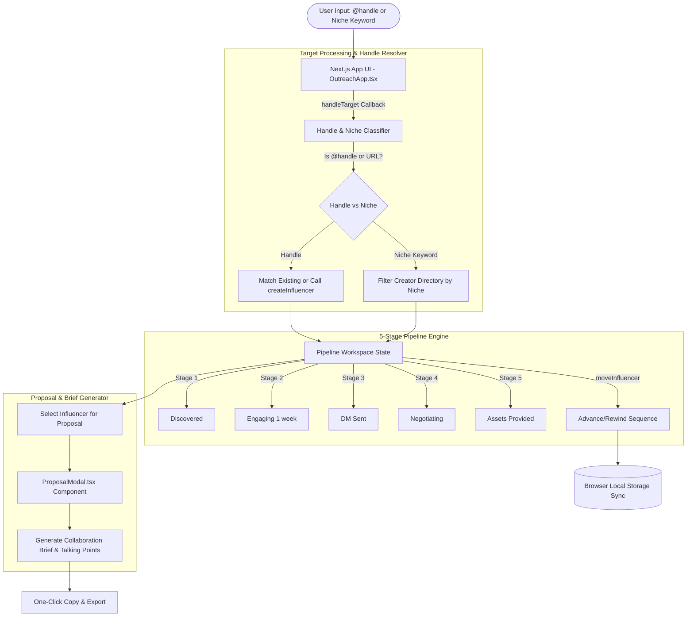

# vVJ — Influencer Outreach Automation Engine Architecture & Strategy Guide

> **Smarketers Off-Page Suite** — Zero-configuration, local-first outreach workspace for discovering micro-influencers, managing relationships through a 5-stage pipeline, generating tailored collaboration proposals, and tracking engagement metrics.

---

## 🤖 Automation Matrix: Automated vs. Human Operator Boundaries

To build authentic creator relationships and ensure high collaboration response rates, vVJ establishes clear operational boundaries:

```
┌─────────────────────────────────────────────────────────┬─────────────────────────────────────────────────────────┐
│ ⚡ 100% AUTOMATED BY vVJ ENGINE                        │ 👤 HUMAN OPERATOR GATEWAY & CREATOR OUTREACH            │
├─────────────────────────────────────────────────────────┼─────────────────────────────────────────────────────────┤
│ • Handle & niche keyword classification (handleTarget)  │ • Selecting target micro-influencers (10K–100K followers)│
│ • Handle normalization (@handle) & directory search     │ • Engaging with creator content (liking/commenting)     │
│ • Dynamic creator upserting (createInfluencer)          │ • Sending initial collaboration DMs / emails            │
│ • 5-stage pipeline state management                     │ • Negotiating rates, terms, and content deliverables    │
│ • Tailored proposal & talking points generator          │ • Dispatching trackable landing page links              │
│ • Local storage persistence & JSON synchronization      │ • Manually advancing pipeline stages                    │
└─────────────────────────────────────────────────────────┴─────────────────────────────────────────────────────────┘
```

---

## 🎯 Intricate Micro-Influencer Marketing Strategy Playbook

### 1. Micro-Influencer Qualification Criteria
Micro-influencers (10,000 to 100,000 followers) generate significantly higher ROI than macro-celebrities:
- **Engagement Rate (>5%)**: Calculate engagement `(Likes + Comments) / Followers`. Accounts with >5% engagement have active, high-intent audiences.
- **Topical Niche Alignment**: Ensure 80%+ of the creator's recent posts focus on your exact industry category (e.g. Fitness, Tech, Design, Finance).
- **Audience Quality**: Inspect comments to ensure engagement is genuine human discussion, not automated bot spam.

### 2. The 5-Stage Relationship Pipeline Strategy
1. **`Discovered`**: Identified via niche search or handle input.
2. **`Engaging (1 week)`**: **The Warm-Up Phase**. Follow the creator, like recent posts, and leave thoughtful comments for 7 days before reaching out. Warm outreach converts 40% higher than cold DMs.
3. **`DM Sent`**: Dispatch your concise collaboration proposal generated by `ProposalModal.tsx`.
4. **`Negotiating`**: Agree on deliverables (e.g. 1x Reel + 2x Story slides with link sticker).
5. **`Assets Provided`**: Deliver product samples, brand assets, and trackable discount/landing page links.

### 3. Collaboration Pitch Framework (`ProposalModal.tsx`)
- **Appreciation Hook**: Reference a specific recent video or post created by the influencer.
- **Clear Value Proposition**: Clearly state product sample availability + creator compensation.
- **Specific Deliverables**: Request a dedicated Reel/TikTok review + Story link sticker pointing to your campaign URL.

---

## 🏗️ End-to-End System Architecture



---

## 💻 Code Internals & Technical Deep Dive

### 1. Dynamic Creator Resolver (`src/components/OutreachApp.tsx`)
Normalizes handles starting with `@` or containing platform domain URLs (`instagram.com/creator`). Calls `createInfluencer()` for new creators.

### 2. Proposal & Talking Points Generator (`src/components/ProposalModal.tsx`)
Generates customized collaboration briefs and talking points tailored to influencer niche and audience size.

---

## 📊 Tech Stack

- **Framework**: Next.js (App Router), React, TypeScript
- **Styling**: Tailwind CSS, Radix UI Primitives, Lucide Icons, Sonner Toasts
- **Persistence**: Browser `localStorage` with seed fallback

---

## 🚀 Running Locally

```bash
# Install dependencies
npm install

# Run dev server
npm run dev

# Open in browser
http://localhost:3000
```

---

## 🌐 Part of Smarketers Off-Page Suite
vVJ Influencer Outreach is part of the Smarketers Off-Page Suite — open-source, local-first marketing applications designed for privacy, speed, and reliability without SaaS dependencies.
